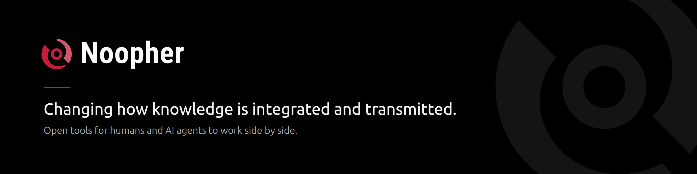

  

We build AI tools that change how knowledge is integrated and transmitted, and we open source the parts others can build on.

### Open source

| Project | What it is |
| --- | --- |
| [**slidra**](https://github.com/Noopher-AI/slidra) | The open `.slidra` presentation format (SVG slides with explicit coordinates) and a browser viewer that plays them. [Live demo →](https://slidra-demo.vercel.app/) |
| [**oat**](https://github.com/Noopher-AI/oat) | Open Agent Team. |

### Get in touch

[noopher.com](https://www.noopher.com) · [ycchen@noopher.com](mailto:ycchen@noopher.com)
